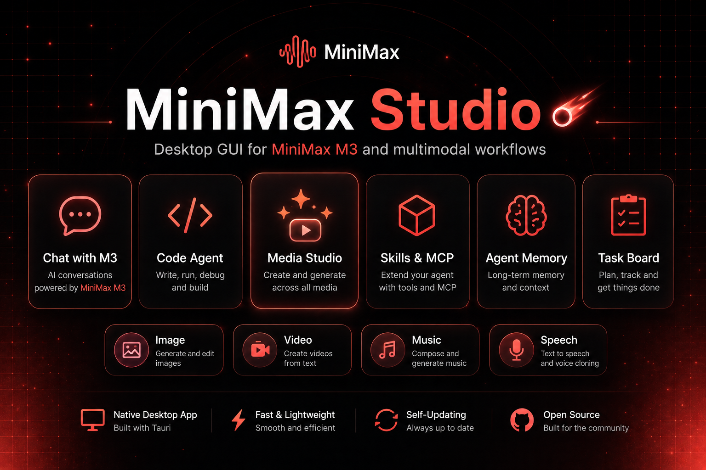
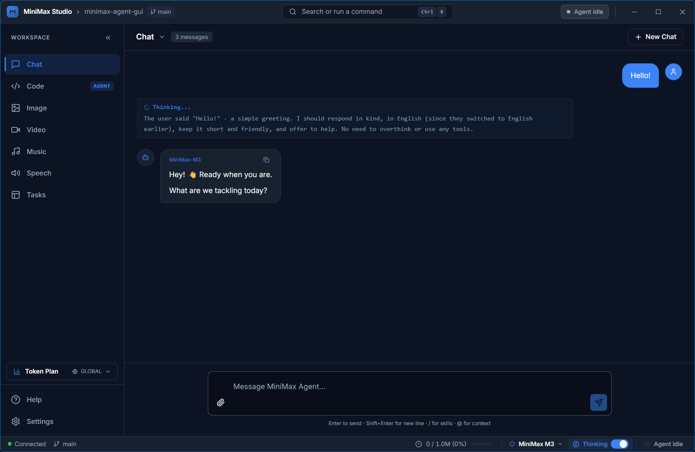
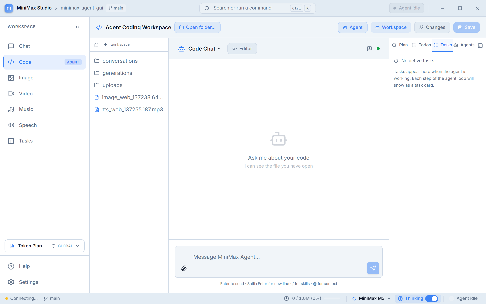
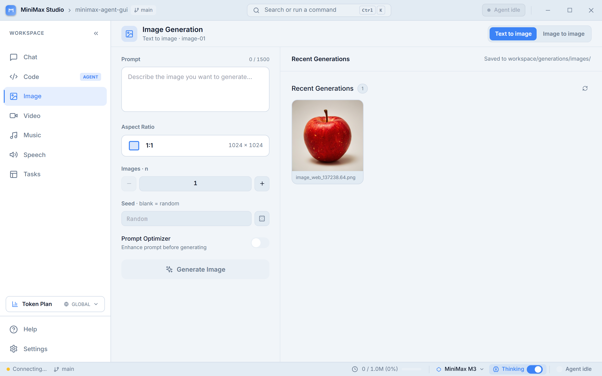

# MiniMax Studio ☄

**Everything MiniMax can do — in one app on your desktop.** Chat and get answers, create images, video, music and voice, get a hand with code, and let it carry your work from one session to the next. One window, nothing technical to set up.

**[⬇ Download](https://github.com/eduardoabreu81/minimax-agent-gui/releases)** ·
**[✨ What you can do](#-what-you-can-do)** ·
**[📖 User Guide](docs/USER_GUIDE.md)** ·
**[🐛 Report a Problem](https://github.com/eduardoabreu81/minimax-agent-gui/issues)**

---

MiniMax Studio brings everything MiniMax can do into a single app on your computer — no browser tabs, no command line, nothing technical to install. Chat and get clear answers (and watch it think things through), turn an idea into images, video, music or speech, get help with code in a real workspace, and have it remember who you are and how you like to work from one session to the next.

> **Good to know:** MiniMax Studio is made for **[MiniMax Token Plan](https://platform.minimax.io/subscribe/token-plan)** subscribers. It's a real app you install on Windows, macOS or Linux — everything (chat, media, code, settings) lives in one window.

## ✨ What you can do

<table>
<tr>
<td width="50%" valign="top">

### 💬 Chat & ask anything
Ask questions, drop in an image or a video, and get clear answers — you can even watch it **think** before it replies. It keeps up with very long conversations, so you never lose the thread, and you can search back through everything you've discussed.

</td>
<td width="50%" valign="top">

### 💻 Get things built
A built-in workspace where the assistant can read, write, and run code **for you** — like having a developer on call. You decide how much it does on its own: ask first, plan it together, or fully hands-off.

</td>
</tr>
<tr>
<td width="50%" valign="top">

### 🎬 Create images, video, music & voice
Turn a simple description into **images**, short **videos**, **songs** (bring your own lyrics), or **speech** in 30+ voices — you can even clone or design a brand-new voice. Everything you make is saved to a gallery.

</td>
<td width="50%" valign="top">

### 🧠 It remembers you
Tell it who you are and how you like to work once — it remembers across sessions, so you're not re-explaining yourself every time you open the app.

</td>
</tr>
<tr>
<td width="50%" valign="top">

### 🔍 Web search & extras
Web search and image understanding are built in and ready to use. Want more? Power users can plug in extra tools and shortcuts — but you don't need any of that to get started.

</td>
<td width="50%" valign="top">

### 📋 See the plan, track progress
For bigger jobs, the assistant lays out a **checklist** and only ticks each item off once it's truly done — so you can follow along and trust nothing got skipped.

</td>
</tr>
<tr>
<td width="50%" valign="top">

### 🔄 Updates made easy
When a new version is ready, updating is **one click** in Settings — no website to visit, no installer to hunt down.

</td>
<td width="50%" valign="top">

### 🌍 In your language
The whole app **and** its built-in help speak English, Português, Español, 日本語, 한국어, and 中文. Stuck on something? Press **?** for help right where you are.

</td>
</tr>
</table>

## 📸 A look inside

<table>
<tr>
<td></td>
<td></td>
</tr>
<tr>
<td align="center"><b>Get things built</b></td>
<td align="center"><b>Create media</b></td>
</tr>
</table>

> 📖 Want a tour of everything? The **[User Guide](docs/USER_GUIDE.md)** walks through every part of the app — the same help you'll find inside it, in all six languages.

## ⚡ Quick Start

You install it like any other app — nothing to set up, no command line, no extra software.

### 1. Download

Grab the installer for your platform from the [latest release](https://github.com/eduardoabreu81/minimax-agent-gui/releases/latest):

All installers are named `MiniMax Studio_<version>_…` — pick the one whose suffix matches your platform:

| OS | File suffix |
|---|---|
| **Windows** (x64) | `_x64-setup.exe` |
| **macOS** (Apple Silicon) | `_aarch64.dmg` |
| **Linux** (x64) | `_amd64.AppImage` or `_amd64.deb` |

### 2. Install

- **Windows** — double-click the `.exe`, follow the wizard
- **macOS** — open the `.dmg`, drag **MiniMax Studio** into **Applications**. The build is not notarized yet, so the first launch needs **right-click → Open** (then *Open* again) to clear Gatekeeper.
- **Linux** — `chmod +x MiniMax\ Studio_*.AppImage && ./MiniMax\ Studio_*.AppImage`, or `sudo dpkg -i MiniMax\ Studio_*.deb`

### 3. Open & set up

MiniMax Studio is built for **MiniMax Token Plan** subscribers. The first launch walks you through connecting your API key — subscribe and get one at [platform.minimax.io](https://platform.minimax.io/subscribe/token-plan). The key is stored locally in the app's per-user data folder and never leaves your machine.

### 4. Stay up to date

When a new version is out, you'll update with **one click** in **Settings → About → Check for updates** — no need to come back here and download again.

## 🧩 How it works

Everything runs inside **one native window** — no command line, no browser tab, no separate server to start. The app ships with its own local engine that talks to MiniMax, launches it automatically when you open the app, and shuts it down when you close it. Your API key and conversations stay **on your machine**.

> Building on it or curious about the internals? The technical guide lives in **[AGENTS.md](AGENTS.md)**.

## 🗺️ What's new & what's next

**Just shipped (v0.4.0):**
Guided first-run setup · pick your assistant's personality · full image / video / music / voice studio (with voice cloning) · one shared composer across chat and code · a task checklist you can follow along · built-in help in 6 languages · one-click installers for Windows, macOS and Linux.

**Coming next:**
- [ ] Automatic updates for installed apps
- [ ] Notarized macOS build (no security warning on first open)
- [ ] Load your existing project rules at startup
- [ ] A richer usage & quota dashboard

## 📖 Need help?

- **[User Guide](docs/USER_GUIDE.md)** — a friendly walkthrough of every part of the app, in all six languages.
- **Built-in help** — press **?** anywhere in the app to get help right where you are.
- **[Report a problem or request a feature](https://github.com/eduardoabreu81/minimax-agent-gui/issues)** — we read every one.

## 🤝 Contributing

Issues and pull requests are welcome. If you'd like to build on MiniMax Studio, the technical guide for developers lives in **[AGENTS.md](AGENTS.md)**.

## 📜 License

MIT — see [LICENSE](LICENSE).

---

Made with care for the MiniMax community · Powered by <b>MiniMax M3</b>

