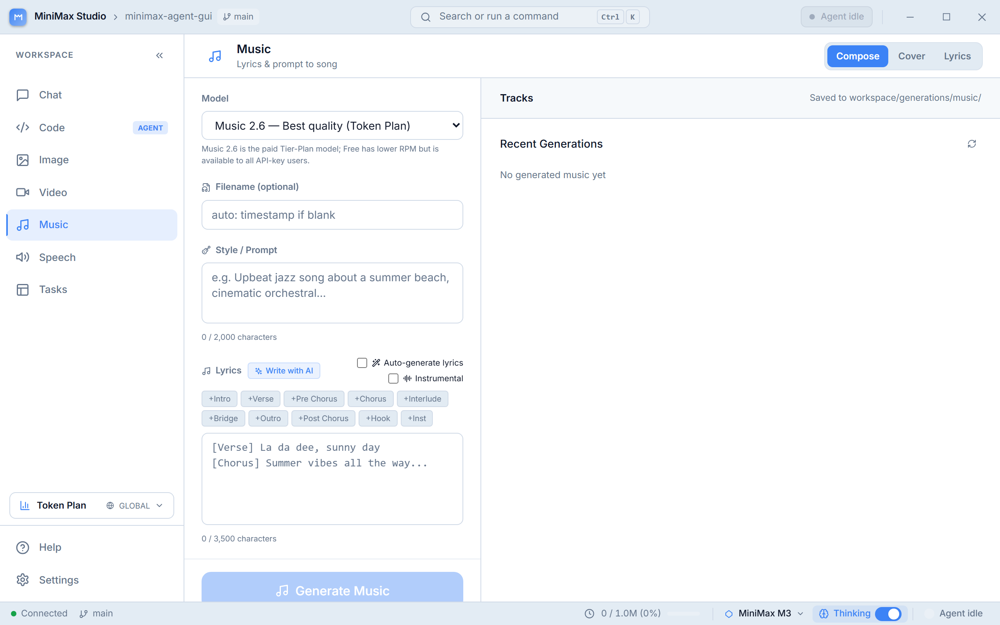
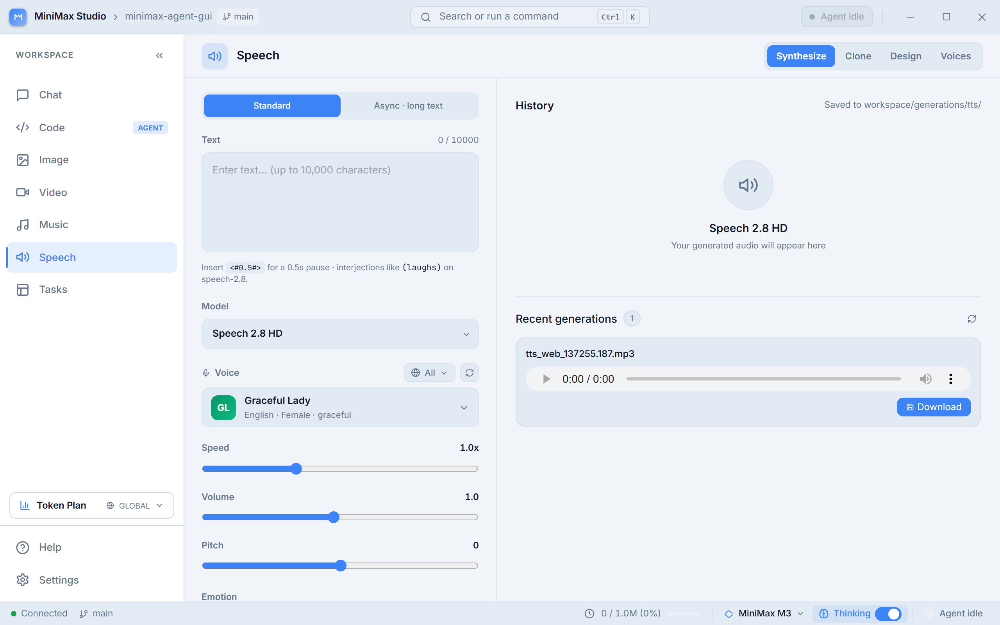

<div align="center">


# MiniMax Agent — Desktop

**The all-in-one desktop workspace for MiniMax M3.** Chat, code, image, video, music, speech, MCP tools, skills, and agent workflows — in one Tauri app that updates itself.

[](https://tauri.app/)
[](https://react.dev/)
[](https://vitejs.dev/)
[](https://tailwindcss.com/)
[](LICENSE)
[](CHANGELOG.md)

**[Releases](https://github.com/<owner>/minimax-agent-gui/releases)** · **[Help](#-in-app-help)** · **[Roadmap](#-roadmap)** · **[Report a Bug](https://github.com/<owner>/minimax-agent-gui/issues)**

</div>

---

## ✨ Highlights

| | |
|---|---|
| 🧠 **M3 by default** — 1M-token context, native image/video input, adaptive thinking block streamed live alongside the response. |
| 🎬 **Media Studio** — Generate image, video, music, and speech in one place. Reference audio for cover, voice design, voice clone. |
| 💻 **Code Workspace** — File explorer, Monaco editor, xterm.js terminal, persistent code-chat with Composer (single source-of-truth input across Chat and Code panels). |
| 🔌 **MCP & Skills** — Built-in web search and image understanding. Bring-your-own MCP servers. Slash-commands for reusable skill templates. |
| 🧠 **Agent Context** — SOUL/IDENTITY/USER/MEMORY files persist across sessions. The agent picks up where it left off. |
| 🔄 **Self-updating** — `tauri-plugin-updater` pulls signed releases from GitHub. You click "Restart", that's it. |
| 🌍 **6 languages** — English, Português (BR), Español, 日本語, 한국어, 中文. |

---

## 🚀 What's new in v0.4.0

**Desktop-first migration.** The Tauri shell is now the only installable interface — no separate web app, no CLI to install, no browser tabs.

- **Tauri 2 shell** wrapping the existing FastAPI backend (bundled as a PyInstaller sidecar) — Rust + React + Vite, single 8 MB installer
- **Auto-updater** wired through `tauri-plugin-updater` — Settings → About → Check for updates
- **In-app Help** with `?` / `F1` shortcuts; the same markdown powers the README via `npm run docs`
- **Skills system** — multi-source loader (User > Extra > Generic > Claude > Codex > Gemini > Built-in)
- **Agent Context System** — SOUL/IDENTITY/USER/MEMORY/daily files mounted into the system prompt
- **Subdirectory Hints** — `AGENTS.md` / `CLAUDE.md` / `.cursorrules` auto-discovered when the agent reads a file
- **Composer** — single source-of-truth for chat input in both Chat and Code panels (slash menu, `@`-ref autocomplete, paperclip attachment, hard-limit guard)
- **Task Board** with todo/plan tool wired into the agent — see live progress, in-progress lock, done-with-verification
- **mmx CLI removed** — every MiniMax API call now goes through direct HTTP (`MiniMaxSyncClient` / `MiniMaxClient`)

---

## 📸 Features

### Chat with M3

Real-time streaming of both the reasoning block and the final response. Per-turn model selector and thinking toggle. File attachments, image understanding, `@`-ref autocomplete (`@file:`, `@folder:`, `@diff`, `@staged`, `@git:N`, `@url:` — type the prefix and pick from the popover, the file content gets prepended to your message). Conversation search, session persistence, and per-turn context-attachment. Long-running workflows surface live steps in the activity panel.


### Media Studio

Generate, iterate, and curate from one tab.

- **Image** — T2I + I2I with subject reference for character-consistent variations. Aspect-ratio picker, batch generation, prompt optimizer, recent gallery.
- **Video** — Hailuo-2.3 text-to-video and image-to-video with multiple durations, resolutions, frame interpolation, and subject reference. Per-generation progress polling.
- **Music** — From prompts or full lyrics, instrumental mode, cover-from-reference-audio, and a built-in lyrics optimizer.
- **Speech / TTS** — 30+ voices, streaming playback, async synthesis for long texts, voice clone from a 10s sample, voice design from a description, batch generation.

Every panel keeps a **Recent Generations** gallery that surfaces the last outputs plus any compatible file already in your workspace — so you never lose track of a generation between sessions.

| Image | Music | Speech |
|---|---|---|
|  |  |  |

### Code Workspace

File explorer, Monaco-style editor, integrated xterm.js terminal, and a persistent code-chat session that knows which files you have open. The chat input is the same Composer used everywhere — single source-of-truth, same slash menu, same `@`-ref autocomplete.

**Three execution modes:**
- **Agent** — asks for approval before risky tools (write/edit, shell, unknown, external MCP) via an inline Approve / Reject modal
- **Plan** — agent drafts an editable plan first; you approve, then it runs end-to-end
- **YOLO** — auto-approves everything for hands-off runs

Live step-by-step activity stream, command-palette shortcuts, and a per-session coding workspace folder you pick on first launch.


### Task Board

When the agent plans multi-step work, todos appear in the workspace sidebar. Each task is **locked** while the agent runs it, then marked **done** only after the agent verifies the result. Live X/Y counter shows progress at a glance. Tasks survive session reloads.


### Skills & MCP Tools

**Skills** are reusable slash-command templates the agent invokes by name. Multi-source loader merges from user dir, extra configured dirs, generic skill hubs, and the bundled defaults — priority is `User > Extra > Generic > Claude > Codex > Gemini > Built-in`. Kimi/agentskills.io schema enforced server-side.

**MCP (Model Context Protocol) tools** — built-in web search and image understanding are always available. Bring-your-own servers in **stdio** or **SSE** transport from Settings → MCP Servers: add, edit, enable/disable, delete, test connections, preview discovered tools. Tool names are namespaced as `mcp_{server_id}_{tool}` to avoid collisions.

**Subdirectory Hints** — when the agent reads a file, it also picks up the nearest `AGENTS.md` / `CLAUDE.md` / `.cursorrules` walking up to 5 parent directories. Project context flows in automatically without you having to paste anything.

### Agent Memory & Context

**`.agent/*.md` files** persist the agent's identity and memory across sessions:
- **SOUL** — agent personality preset
- **IDENTITY** — name, role, communication style
- **USER** — your profile, language preference, working context
- **MEMORY** — long-term notes the agent can append to
- **`daily/{YYYY-MM-DD}.md`** — automatic session log

The first-run **Onboarding Wizard** walks you through filling them in. If files are missing or incomplete, an **IncompleteContextBanner** appears in the title bar with a one-click shortcut to fix it.

The agent also has a **`memory` tool** to write back into these files during a run — long-running agents accumulate context without losing it between sessions.

### Customization

- **9 themes** including light/dark, matrix-rain, and accent variants — `Themes` in Settings
- **6 languages** for the UI: English, Português (BR), Español, 日本語, 한국어, 中文
- **Command Palette** (`Ctrl/Cmd+K`) — fuzzy-search every panel, action, and shortcut
- **Keyboard shortcuts** — `?` and `F1` for Help, `Esc` to close modals, panel-specific shortcuts via Settings
- **Onboarding** — first-launch wizard + the **QuickSettings** popover for in-flight tweaks
- **Status Bar** at the bottom shows live model, plan tier, context usage, and a breakdown-by-source popover

### Settings

Index rail with all the knobs in one place: API key, default model, theme, language, **agent context** (edit SOUL/IDENTITY/USER/MEMORY in-app), **skills** (per-skill detail panel), **MCP Servers** (add/edit/test), **Generation Defaults** (audio format, image size), **Keyboard Shortcuts**, and **About** (with **Check for updates** button).


### Reliability

- **Session Protection** — warns before navigating away, refreshing, or closing the tab when there's an active session with unsent content or pending approvals
- **Auto-save** — every message persists to `workspace/conversations/` immediately; tab switch / refresh / restart picks up where you left off
- **Conversation Search** — find past chats and code sessions by title, content, or attachment name
- **Token attribution** — per-source breakdown (system prompt / skills / memory / MCP tools / default) in the StatusBar popover, so you can see what's eating your context window
- **Compact events** — when context fills up, the backend summarizes automatically with a structured event log (force / auto / legacy compact_reason)

---

## ⚡ Quick Start

### Prerequisites

- **Python 3.10+**
- **Node.js 18+**
- **Rust toolchain** (stable) — install via [rustup](https://rustup.rs/)
- **MiniMax API key** — get one at [platform.minimax.io](https://platform.minimax.io)

### Run in dev mode

```bash
# 1. Clone
git clone https://github.com/<owner>/minimax-agent-gui.git
cd minimax-agent-gui

# 2. Install Python deps
pip install -e .
pip install -r web/backend/requirements.txt

# 3. Launch the Tauri shell
cd desktop
npm install
npm run tauri:dev
```

The first `tauri:dev` takes ~5 minutes (compiles Rust deps from scratch). Subsequent runs are fast — Vite hot-reloads the React frontend, and the Rust side rebuilds only on `src-tauri/` changes.

On launch, paste your API key into Settings → API. The key is stored locally in `config/config.yaml` (gitignored) and never leaves your machine.

> **Windows tip:** Use `py -3.10` instead of `python` if you have multiple Python versions on PATH. The PyInstaller sidecar is built against 3.10.
>
> **Linux:** First build needs `libwebkit2gtk-4.1-dev`, `libappindicator3-dev`, `librsvg2-dev`, `patchelf`. See [Tauri Linux prerequisites](https://tauri.app/start/prerequisites/#linux).

### Build a production installer

```bash
cd desktop
npm run tauri:build
```

Generates platform-native installers in `desktop/src-tauri/target/release/bundle/`:
- **Windows** — `.msi` + NSIS `.exe`
- **macOS** — `.dmg` + `.app`
- **Linux** — `.AppImage` + `.deb`

---

## 🔄 Updates & Releases

The app **updates itself** via `tauri-plugin-updater`. Settings → About → **Check for updates** polls GitHub Releases; if a newer version is signed with the matching key, it downloads in the background and prompts you to restart.

Each release:

1. **Tag** the commit: `git tag v0.4.1 && git push origin v0.4.1`
2. **CI** (`.github/workflows/release.yml`) builds ubuntu/windows/macos in parallel
3. **Tauri CLI** signs the bundles with `TAURI_SIGNING_PRIVATE_KEY` (GitHub Secret)
4. **Per-target `*-updater.json`** is generated and uploaded alongside the installers
5. **GitHub Release** is created with everything attached

The app's updater polls those JSON files, verifies the signature against the pubkey baked into `tauri.conf.json > plugins.updater.pubkey`, and offers the update.

### First-release setup (one-time)

```bash
# 1. Generate the signing key locally
cargo install tauri-cli --version "^2.0"
tauri signer generate -w ~/.tauri/minimax-agent.key.json

# 2. Paste the PUBLIC key into desktop/src-tauri/tauri.conf.json:
#      "plugins.updater.pubkey": "<base64 from the file>"
# 3. Add the PRIVATE key contents (cat ~/.tauri/minimax-agent.key.json)
#    as GitHub Secret: TAURI_SIGNING_PRIVATE_KEY
#    Add a passphrase too if you set one: TAURI_SIGNING_PRIVATE_KEY_PASSWORD
```

> **macOS caveat:** `.dmg` won't install via the updater without an Apple Developer ID signing cert ($99/yr). Windows users get a SmartScreen warning without an EV cert ($300/yr). Linux has no such requirement.

---

## 🌐 Cross-OS Builds

GitHub Actions matrix builds all three platforms on every `v*` tag push. See `.github/workflows/release.yml`.

```
ubuntu-latest  ─┐
windows-latest ─┼─► tauri build ─► sign ─► GitHub Release
macos-latest   ─┘
```

Each runner rebuilds the Python backend sidecar (PyInstaller) for its native ABI before running `npm run tauri:build`. Build time: ~5–8 min on warm cache.

---

## 🏗️ Architecture

```
┌──────────────────────────────────────────────────────────┐
│                  Tauri shell (Rust)                       │
│  ┌──────────────────────┐  ┌───────────────────────────┐ │
│  │   React frontend     │  │   Bundled sidecar         │ │
│  │   Vite + Tailwind     │◄─┤   FastAPI + Python        │ │
│  │   (localhost:1420)    │  │   (localhost:8765)        │ │
│  └──────────────────────┘  └───────────────────────────┘ │
│         ▲                           ▲                   │
│         │ tauri-plugin-updater      │ direct HTTP        │
│         │ (GitHub Releases)         │ (no CLI)           │
└──────────────────────────────────────────────────────────┘
```

- **Frontend** (`desktop/src/`) — React 18 + Vite + Tailwind, single SPA with tab routing. Hot-reloads in dev, bundled into the Tauri shell for release.
- **Backend** (`web/backend/`) — FastAPI + WebSocket for streaming chat. All MiniMax API calls go through `mini_max_mcp/client.py` (no subprocess, no `mmx` CLI).
- **Agent** (`mini_agent/`) — Reusable async agent loop, LLM routing, tool execution, token summarization. Used by both the desktop app and the `mini-agent` CLI.
- **Sidecar** (`desktop/src-tauri/binaries/backend`) — PyInstaller-bundled FastAPI for production. Built per-platform because the binaries aren't interchangeable.

The Tauri shell auto-spawns the sidecar on launch; Vite proxy in dev forwards `/api` and `/ws` to the local backend.

---

## ⚙️ Configuration

| File | Purpose |
|---|---|
| `config/config.yaml` | API key, region, default model, custom MCP servers, skills dir overrides (gitignored — secrets stay local) |
| `desktop/src-tauri/tauri.conf.json` | Tauri shell config: window size, bundle targets, plugins.updater pubkey/endpoints, sidecar path |
| `desktop/src/i18n/*.json` | 6 locale files (en, pt-BR, es, ja, ko, zh-CN) |

Environment variables override `config/config.yaml`:

| Variable | Purpose |
|---|---|
| `MINIMAX_API_KEY` | Override API key |
| `MINIMAX_API_BASE` | Override base URL (e.g. for proxies or alternative Anthropic-compatible endpoints) |

---

## 💰 Pricing & Plans

MiniMax Agent works with the new **MiniMax Token Plan** (credit-based, USD). The default chat model is **MiniMax M3** (with M2.7 and M2.7-highspeed as fallbacks). Prices are summarized from the official pricing page — always check [platform.minimax.io](https://platform.minimax.io) for the latest.

| Tier | Price | Includes |
|---|---|---|
| **Plus** | $20 / mo | M3 chat, image, speech, music. Multimodal input. **No** video generation, **no** MCP tool credit. |
| **Max** | $50 / mo | Plus features + Hailuo video (3/day) + MCP tool credit. |
| **Ultra** | $120 / mo | Max features with higher video limits (5/day) + priority credit refresh. |

> The Quota Dashboard and the plan badge in the sidebar call the Token Plan `remains` endpoint directly (`GET /v1/api/openplatform/coding_plan/remains`). If auto-detection fails, set `minimax.plan: plus|max|ultra` in `config/config.yaml` as a manual fallback.

---

## 🗺️ Roadmap

### Shipped (v0.4.0 — Tauri desktop-first)
- [x] Tauri 2 shell (Rust) + Vite + React + Tailwind + shadcn-style components
- [x] Speech (T2A) full stack — 30+ voices, async/sync, voice clone, voice design, streaming playback
- [x] **Settings** index rail with all knobs in one panel
- [x] **Status Bar** with live model + plan + context usage
- [x] **Skills system** (multi-source, Kimi spec) — 175+ tests
- [x] **Agent Context System** (`.agent/*.md`) — SOUL/IDENTITY/USER/MEMORY + daily logs
- [x] **Composer** single source-of-truth (Chat + Code panels share the same input)
- [x] **Task Board** with todo/plan tool — agent plans work, locks during execution, verifies on done
- [x] **Subdirectory Hints** (PR D) — `AGENTS.md` / `CLAUDE.md` / `.cursorrules` auto-discovered on file reads
- [x] **Auto-updater** via `tauri-plugin-updater` — signed releases, in-app download + restart
- [x] **In-app Help** — markdown under `desktop/src/help/{locale}/` feeds both the Help panel and the README
- [x] **mmx CLI removed** — app no longer depends on any external CLI

### Next
- [ ] **Personality presets** — 5 SOUL.md presets (concise / friendly / mentor / expert / creative)
- [ ] **CLAUDE.md / .cursorrules startup loading** + cursor/rules/*.mdc support
- [ ] **Quota Dashboard refinements** — per-tier model semantics polish
- [ ] **GitHub Releases automation** — first signed release end-to-end

---

## ❓ In-app Help

Press **`?`** from anywhere (when not typing into a field) or **`F1`** to open the in-app Help panel. The same keyboard shortcut works in Chat, Code, Media panels, and Settings.

Help topics in `desktop/src/help/{locale}/{topic}.md` (en + pt-BR translated; other locales fall back to en). Generate the README from the same markdown:

```bash
cd desktop
npm run docs      # screenshots + readme in one go
npm run readme    # regenerate desktop/README.md from current help content
npm run shots     # capture fresh screenshots via Playwright
```

---

## 🤝 Contributing

Issues and PRs welcome at [github.com/<owner>/minimax-agent-gui/issues](https://github.com/<owner>/minimax-agent-gui/issues).

For local development:

```bash
# Run frontend tests
cd desktop && npm test

# Run backend tests (pytest, requires py -3.10)
py -3.10 -m pytest tests/

# Lint / type-check the Rust side
cd desktop/src-tauri && cargo clippy
```

`AGENTS.md` (in the repo root) is the canonical guide for AI agents working on this codebase. Read it before opening a PR.

---

## 📜 License

MIT — see [LICENSE](LICENSE).

---

<div align="center">

<sub>Made with care for the MiniMax community · Powered by **MiniMax M3**</sub>

</div>