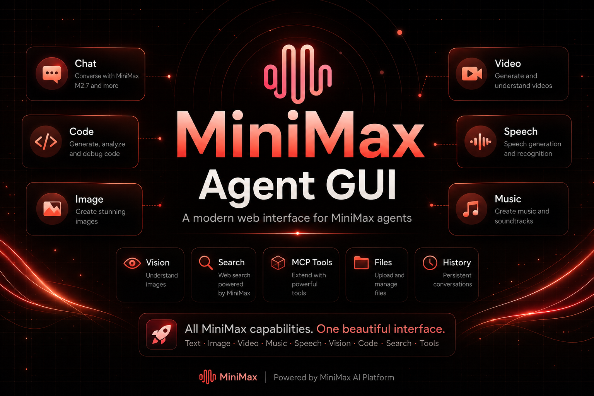

<div align="center">
  
</div>

# 🤖 MiniMax Agent GUI

> A simple all-in-one web interface for MiniMax — Chat, Image, Video, Music, Speech, MCP tools, skills, and agent workflows in one place.
>
> Built with ❤️ for the MiniMax community.

[](https://fastapi.tiangolo.com/)
[](https://react.dev/)
[](https://vitejs.dev/)
[](https://tailwindcss.com/)
[](LICENSE)

## Product Positioning

MiniMax Agent GUI is a simple all-in-one web interface for MiniMax. It gives MiniMax users a practical GUI for chat, image, video, music, speech, MCP tools, skills, and agent workflows without jumping between CLI commands, scripts, and separate API calls. The default chat model is **MiniMax M3** (with M2.7 and M2.7-highspeed available via Settings).

The Code Workspace is part of the app, but it is not the whole product.

## Features

- **Chat** — Persistent conversations with per-turn model + thinking controls, real-time token-by-token streaming of both reasoning and response, file attachments, image understanding, markdown rendering, copy buttons, and recent-conversation sidebar
- **Image Generation** — Text-to-image and image-to-image with aspect ratio, batch, gallery, prompt optimizer, and recent generations history
- **Video** — Hailuo-2.3 text/image-to-video with multiple durations, resolutions, and recent video history
- **Music** — Music generation from prompts or lyrics, instrumental mode, cover from reference audio, and recent music history
- **Speech / TTS** — 30+ voices, speed control, streaming playback, and recent speech history
- **MCP Tools** — Built-in Web Search and Image Understanding, configurable custom MCP servers, connection testing, tool discovery, and external MCP tools loaded into agent sessions
- **Skills & Agent Workflows** — Slash commands, skill templates, Plan Mode with editable approve-and-run drafts, tool permission approvals, and agent-driven multi-step tasks
- **Code Workspace** — File explorer, editor, terminal, and persistent code-chat sessions
- **Multi-language** — English, Português (BR), 日本語, 한국어, Español, 中文

### Chat details

- **Model selector** (per turn): M3 (default), M2.7, M2.7-highspeed. Persisted per panel.
- **Thinking toggle**: enables M3's extended `thinking: {type: "adaptive"}` block — visible as a separate always-expanded reasoning block above the assistant's response. Persisted per panel.
- **Real-time streaming**: tokens arrive word-by-word for both the thinking block and the final response (no more 10-minute silent waits).
- **Session persistence**: switching tabs or refreshing keeps the same conversation; only **New Chat** starts a new one.

## Quick Start

Prerequisites: **Python 3.10+**, **Node.js 18+**, a [MiniMax API key](https://platform.minimax.io).

```bash
# 1. Clone
git clone https://github.com/eduardoabreu81/minimax-agent-gui.git
cd minimax-agent-gui

# 2. Install Python + Node dependencies
pip install -e .
pip install -r web/backend/requirements.txt
(cd web && npm install)

# 3. Start the dev servers
cd web && npm run dev
```

`npm run dev` starts both services together:
- **Backend** — FastAPI on `http://localhost:8000`
- **Frontend** — Vite dev server on `http://localhost:3000`

Open **http://localhost:3000** in your browser. On first launch the
**Settings → API** panel will prompt you to paste your MiniMax API key
— that's all you need to start chatting. The key is stored locally in
`config/config.yaml` (which is gitignored, so it never leaves your
machine).

To stop both servers, press `Ctrl+C` in the terminal that ran `npm run dev`.

> **Windows tip:** If you have multiple Python versions on PATH, use
> `py -3.10` instead of `pip`/`python` for the install steps above. The
> repo's `web/package.json` already uses `py -3.10` to launch the
> backend, so the dev server works on any machine with Python 3.10+
> registered via the `py` launcher — no need to edit anything.

> **Headless / CI:** The same key can also be set by editing
> `config/config.yaml` directly, or via the `MINIMAX_API_KEY`
> environment variable. The API base URL can be overridden with
> `MINIMAX_API_BASE`. Both env vars take precedence over the values in
> `config/config.yaml`.

## Usage

### Chat

- Pick a model (M3 / M2.7 / M2.7-highspeed) and toggle Thinking right
  below the composer. Both persist per panel.
- Upload images or text files, toggle Web Search and Image
  Understanding in Settings.
- Conversations auto-save, persist across refresh, and can be renamed
  or deleted. Click **New Chat** to start a fresh session.

### Image Generation

```
Prompt: "A futuristic city at sunset"
Aspect Ratio: 16:9  |  Batch: 4  |  Prompt Optimizer: ON
→ Generate
```

Upload a reference image for character-consistent variations (I2I).

### Video

Describe a scene or upload an image to generate video with progress tracking.

### Music

Enter a prompt and optional lyrics to generate songs. Enable instrumental mode for background music or upload reference audio for cover generation.

### TTS

Type text, pick a voice, adjust speed, and generate speech.

> **Planned:** Future versions will include GUI-ready prompt examples based on official MiniMax documentation examples, adapted for Image, Video, Music, and TTS panels.

### MCP Tools

Open **Settings > Tools** to manage built-in MiniMax tools and custom MCP servers. Custom MCP servers support **stdio** and **SSE** transports. You can add, edit, enable/disable, delete, and test connections. Enabled servers are loaded into new agent sessions; tool names are prefixed as `mcp_{server_id}_{tool_name}` to avoid collisions.

> **Note:** External MCP tools require approval in Agent mode; YOLO mode auto-approves them. HTTP transport is not implemented yet. MCP tools are loaded when a new agent session is created, so changing MCP server config may require starting a new chat or session to reload tools.

### Code Workspace

Switch to the Code tab for a file explorer, editor, terminal, and persistent code-chat sessions. The agent can read, write, and edit files in your workspace. You can switch between **Agent**, **Plan**, and **YOLO** modes. Plan mode creates an editable draft plan before execution; once approved, the agent receives the full plan and runs it step by step.

**Tool Permissions** — Agent mode asks for approval before risky tools (write/edit, shell, unknown, and external MCP tools) via an Approve / Reject modal. YOLO mode auto-approves all tools. Plan mode uses Agent permissions after Approve & Run.

### Agent Outputs

Generated media files are saved under `workspace/generations/`:

```
workspace/generations/
├── images/   # Generated images
├── videos/   # Generated videos
├── music/    # Generated music
└── tts/      # Generated speech
```

Each media panel also displays a **Recent Generations** gallery that surfaces outputs from `workspace/generations/` as well as compatible files in the workspace root, so you can preview and download past results without leaving the panel.

## Configuration

| File | Purpose |
|------|---------|
| `config/config.yaml` | API key, region (`global` or `cn`), default model, API base URL override, built-in tool toggles, custom MCP servers |

Environment variables:

| Variable | Purpose |
|----------|---------|
| `MINIMAX_API_KEY` | Override API key |
| `MINIMAX_API_BASE` | Override base URL |

### LLM Protocol

MiniMax Agent GUI uses the **Anthropic SDK** as its single LLM protocol.
MiniMax's own docs recommend the Anthropic-compatible interface for
prompt-cache benefits, and it supports the full feature set we expose
(streaming thinking blocks, tool use, image/video input on M3, etc.).

The default endpoint is MiniMax's Anthropic-compatible route:
`https://api.minimax.io/anthropic` (or `https://api.minimaxi.com/anthropic`
for the China region).

You can override `api_base` in `config/config.yaml` or via the
`MINIMAX_API_BASE` environment variable if you need to route through a
proxy or an alternative Anthropic-compatible endpoint. Leave it empty
to use the MiniMax defaults.

Example MCP server configuration in `config/config.yaml`:

```yaml
mcp_servers:
  local-filesystem:
    name: Local Filesystem
    transport: stdio
    command: npx
    args:
      - "-y"
      - "@modelcontextprotocol/server-filesystem"
      - "./workspace"
    env: {}
    enabled: true
```

## Pricing & Plans

MiniMax Agent GUI works with the new **MiniMax Token Plan** (credit-based,
in USD). All tiers include the **MiniMax-M3** chat model (with M2.7 and
M2.7-highspeed as fallbacks) and credit allowance for all media. Prices
are summarized from the official pricing page — always check
[platform.minimax.io](https://platform.minimax.io) for the latest.

| Tier | Price | Includes |
|------|-------|----------|
| **Plus**  | $20 / mo | M3 chat, image, speech, music; multimodal **input** (image+video understanding). **No** Hailuo video generation, **no** MCP tool credit. |
| **Max**   | $50 / mo | Plus features + Hailuo video generation (5/day) + MCP tool credit. |
| **Ultra** | $120 / mo | Max features with higher video gen limits and priority credit refresh. |

> **Plan auto-detection:** The Quota Dashboard and the plan badge in
> the sidebar are populated by calling the Token Plan `remains`
> endpoint directly (`GET /v1/api/openplatform/coding_plan/remains`).
> This works out of the box — no extra CLI is required. If you happen
> to have the official `mmx` CLI installed, the backend will fall back
> to it if the direct call fails. If auto-detection can't reach the
> API for any reason, set `minimax.plan: plus|max|ultra` in
> `config/config.yaml` as a manual fallback.

## Roadmap

### Shipped (0.3.0 — Token Plan + M3)
- [x] **M3 as default chat model** (1M context, agentic, native image/video input)
- [x] **Per-turn model selector** (M3 / M2.7 / M2.7-highspeed) with `localStorage` persistence
- [x] **Per-turn thinking toggle** (M3 only) — `thinking: {type: "adaptive"}` with persisted ON/OFF
- [x] **Real-time token-by-token streaming** for both thinking and response (no more 10-minute waits)
- [x] **Thinking block** as a separate always-visible message in the chat timeline
- [x] **Copy button** on every assistant message with "Copied!" feedback
- [x] **Token Plan auto-detection** — Plus / Max / Ultra inferred from a direct call to the Token Plan `remains` endpoint (works without the `mmx` CLI installed)
- [x] **Token Plan web_search** wired to the `/v1/coding_plan/search` endpoint (uses `q` key)
- [x] **Image attachment framing** — agent receives description as its view of the image, not as a stray note
- [x] **MIT license** and `pyproject.toml` 0.3.0 release metadata

### Shipped (0.2.x)
- [x] Command Palette (Ctrl+K)
- [x] Live agent activity panel (steps, tools, thinking)
- [x] Quick Settings panel
- [x] MCP tool toggles (web search, image understanding)
- [x] Slash skills and agent workflows
- [x] Theme system (9 themes, light/dark)
- [x] Dual-layout code workspace (IDE mode / Agent mode)
- [x] Generations folder structure for media outputs
- [x] Session Protection — Guards against accidental context loss when navigating tabs, refreshing, or leaving the page
- [x] Conversation Search — Find past chats and code sessions by title, content, or attachment
- [x] Recent Generations in media panels — Image, Video, Music, and TTS panels show a browsable history of past outputs plus compatible files in the workspace
- [x] Agent Plan Mode — Editable plan draft with approve-and-run workflow in the Code Workspace
- [x] Configurable MCP Servers — Manage custom stdio/SSE MCP servers from Settings
- [x] MCP Connection Test & Tool Discovery — Test configured servers and preview discovered tools
- [x] External MCP Tool Runtime — Enabled MCP server tools are loaded into new agent sessions with safe prefixed names
- [x] Permission System — Agent tool execution policy with auto/ask/reject decisions and Code Workspace approve/reject modal

### Phase 1 — Foundation
_Complete. All Phase 1 items have shipped._

### Phase 2 — Productivity
- [ ] **Task Board (Kanban)** — Project planning with todo/in-progress/done columns

### Phase 3 — Extensibility
- [ ] **Plugin System** — Community extensibility with custom tabs and backends
- [ ] **Custom Skills** — User-defined skill templates per project type

### Phase 4 — Polish
- [ ] **Sandboxed Preview** — Secure iframe preview for generated code
- [ ] **Official Prompt Examples** — Add curated prompt examples for Image, Video, Music, and TTS based on MiniMax documentation, converted from API examples into GUI-ready prompt presets

## License

MIT — see [LICENSE](LICENSE)

---

<div align="center">

Made with ❤️ powered by MiniMax

**[Report Bug](https://github.com/eduardoabreu81/minimax-agent-gui/issues)** • **[Request Feature](https://github.com/eduardoabreu81/minimax-agent-gui/issues)**

</div>
