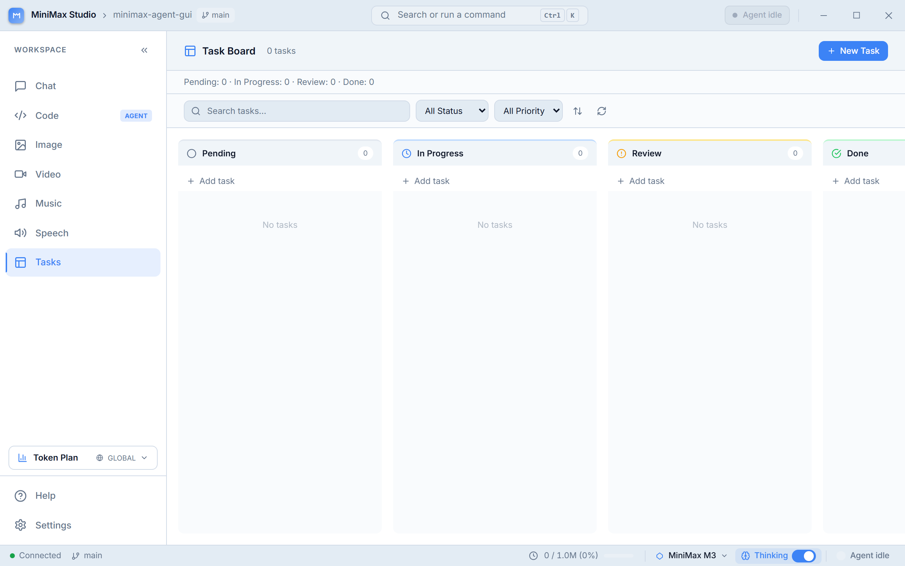
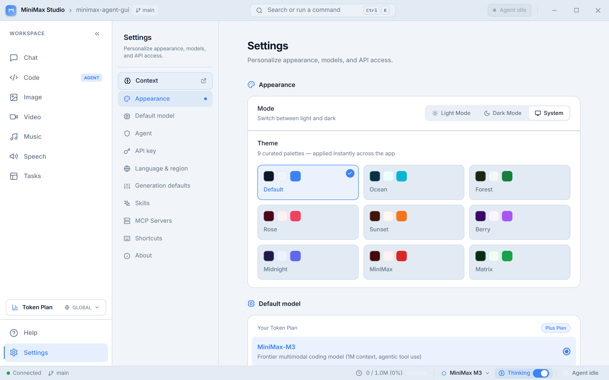

<!--
  GENERATED FILE — do not edit by hand.
  Source: desktop/src/help/<lang>/*.md  ·  Rebuild: cd desktop && npm run docs
-->

# MiniMax Agent — User Guide

This guide mirrors the in-app Help (press `F1` or `?` inside the app). It is
written in English here; the app shows it in whichever of the six languages
you have selected (English, Português, Español, 日本語, 한국어, 中文), falling
back to English for any untranslated topic.

## Contents

- [Getting Started](#getting-started)
- [Chat](#chat)
- [Code Agent](#code-agent)
- [Media Studio](#media-studio)
- [Task Board](#task-board)
- [Settings](#settings)
- [Keyboard Shortcuts](#keyboard-shortcuts)

## Getting Started

MiniMax Agent is a desktop workspace for the MiniMax platform — chat with
expert models, run an autonomous coding agent, generate media, and track
work, all from one window.

### First launch

When the app starts it waits for the local backend to come online (a brief
loading screen), then opens on the **Chat** panel. If a setup wizard
appears, it walks you through connecting your MiniMax account and filling in
your project context.

### The workspace at a glance

- **Sidebar** (left) — switch between Chat, Code, Image, Video, Music,
  Speech, and Tasks. Collapse it with the chevron to reclaim space.
- **Title bar** (top) — app identity and the command palette button.
- **Status bar** (bottom) — the active model and the extended-thinking
  toggle. Whatever you pick here is what the next message uses.
- **Settings & Help** (sidebar footer) — account, models, theme, and this
  help.

### Picking a model

Use the model picker in the status bar to choose which model handles your
next message. Extended thinking is available on `MiniMax-M3`; the toggle is
disabled for models that don't support it.

### Next steps

- Open the **Chat** panel and send your first message.
- Try the **Code Agent** for hands-on coding tasks.
- Press `Ctrl/Cmd + K` to open the command palette from anywhere.

## Chat

The Chat panel is a conversation with MiniMax expert models. Use it for
questions, drafting, analysis, and anything that doesn't need to touch your
filesystem.

### Sending a message

Type in the composer at the bottom and press `Enter` to send (`Shift + Enter`
inserts a newline). The model streams its reply token by token.

### Composer features

- **Slash commands** — type `/` at the start of the composer to open the
  command menu.
- **@-references** — type `@` to attach context (files or other references)
  to your message as chips.
- **Attachments** — add files for the model to read alongside your prompt.

### Model & thinking

The active model and the extended-thinking toggle live in the status bar at
the bottom of the window and are shared with the Code Agent — switching here
affects the next message in either panel.

### Starting fresh

Use the command palette (`Ctrl/Cmd + K`) and choose **New chat** to clear the
conversation and start over.

## Code Agent

The Code Agent (the **Code** panel) is an autonomous coding workspace. Unlike
Chat, it can read and write files and run commands in a real workspace to
carry out multi-step engineering tasks.

### How it works

Describe what you want — a feature, a fix, a refactor — and the agent plans,
edits files, and runs commands to get there. Its progress streams live, with
a todo list showing the steps it's working through.

### The terminal

An integrated terminal shows the commands the agent runs and their output.
This runs against the real backend, so it reflects actual execution rather
than a simulation.

### Model & thinking

Like Chat, the Code Agent uses the model and extended-thinking setting from
the status bar. `MiniMax-M3` with thinking enabled is the strongest option
for complex tasks.

### Tips

- Be specific about the outcome you want and any constraints.
- Review the agent's plan and diffs as they stream in.
- Keep tasks focused — smaller, well-scoped requests run more reliably.

## Media Studio

The media panels turn prompts into images, video, music, and speech using
MiniMax generation models. Each lives in its own sidebar entry.

### Image

Describe the image you want and generate it. Use the character counter to
keep prompts within limits, and download or reuse results.

### Video

Generate short video clips from a prompt. Video generation is the most
compute-intensive feature and may be gated to higher subscription tiers.

### Music

Generate music tracks from a text description of style, mood, and
instrumentation.

### Speech (TTS)

Turn text into spoken audio. Pick a voice and generate narration or replies.

### Credits

Media generation consumes credits. The sidebar's credit widget shows your
current balance and refreshes after each generation completes.

## Task Board

The Task Board (the **Tasks** panel) tracks work items in a simple board so
you can see what's planned, in progress, and done.

### Working with tasks

Create tasks, move them between columns as work progresses, and use the
stats bar to see counts at a glance.

### Why it's here

Long-running agent work and multi-step projects are easier to follow when
the steps are visible. The board gives you a persistent place to capture
that, separate from any single conversation.

## Settings

The Settings panel (sidebar footer) is where you configure your account,
models, and appearance.

### Account & API

Connect your MiniMax account and manage the API configuration the app uses
to reach the platform. Your subscription tier (Plus / Max / Ultra) is
detected here and controls which features are available.

### Models

Review the available models. The default model for new messages is chosen in
the status bar, but model-related preferences live here.

### Appearance

Switch between light and dark themes. Some themes include extra visual
effects that you can toggle on or off.

### Language

The interface is available in several languages. Changing the language also
switches this help content to the matching language where a translation
exists, falling back to English otherwise.

### Project context

The Agent Context system lets you describe your project once so the agent has
the background it needs. You can open it from the setup wizard or the context
banner.

## Keyboard Shortcuts

| Shortcut | Action |
| --- | --- |
| `Ctrl / Cmd + K` | Open the command palette |
| `F1` or `?` | Open Help |
| `Enter` | Send the current message |
| `Shift + Enter` | New line in the composer |
| `/` | Slash commands (start of composer) |
| `@` | Attach a context reference |

### Command palette

The command palette (`Ctrl/Cmd + K`) is the fastest way to navigate and run
actions — jump to any panel, start a new chat, open settings, or toggle the
theme without leaving the keyboard.

---

Generated from the in-app Help · `npm run docs`
